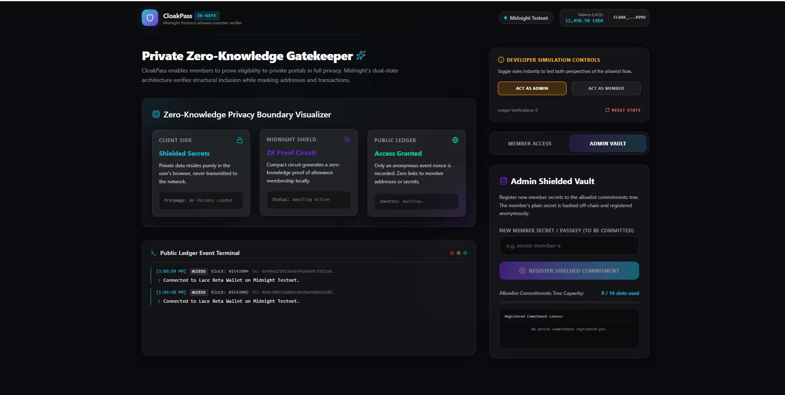
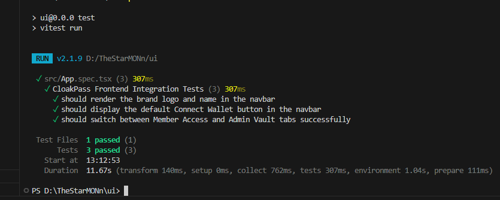

# CloakPass: Shielded Zero-Knowledge Gatekeeper

CloakPass is a decentralized, privacy-preserving gatekeeper application (dApp) built on the Midnight blockchain. It allows users to prove membership in a private allowlist using Zero-Knowledge proofs without disclosing their wallet address, identity, or transaction history.

[](https://github.com/cloakpass/cloakpass-monorepo/actions)

---

## 1. Project Architecture

The CloakPass dApp comprises three primary systems executing over Midnight's dual public/private state model:
1. **Smart Contract & Circuits (Compact)**: Defines the private allowlist membership proofs using a local ZK-circuit and stores public root commitments in the ledger state.
2. **Event Indexer Service (Node.js/Express)**: Listens for anonymous validation events (`accessGranted`) recorded on-chain, serving them via a public API.
3. **Obsidian Glassmorphism Dashboard (React / TypeScript / Vite)**: Integrates the Lace Wallet connector, client-side witness prover, and admin vault dashboard.

```mermaid
graph TD
    subgraph Client Side (Shielded)
        A[User Secret Key / Preimage] -->|Off-chain Witness| B(Compact ZK Circuit)
        M[Allowlist Merkle Path] -->|Off-chain Witness| B
    end

    subgraph Midnight Network
        B -->|ZK Proof Verification| C[On-chain Ledger State]
        C -->|Valid Root Match| D[accessGranted Nonce Logged]
    end

    subgraph Public Infrastructure
        D -->|Event Emission| E[Lightweight Indexer]
        E -->|JSON API /events| F[React UI Dashboard]
    end
    
    style A fill:#06B6D4,stroke:#0891B2,stroke-width:2px,color:#fff
    style B fill:#6D28D9,stroke:#5B21B6,stroke-width:2px,color:#fff
    style D fill:#10B981,stroke:#059669,stroke-width:2px,color:#fff
```

---

## 2. Privacy Model Matrix

| Observer Type | What They CAN See | What They CANNOT See |
| :--- | :--- | :--- |
| **Public Observer** (Blockchain Explorer) | • Merkle root hash of commitments.<br>• Anonymous event nonces (`eventId`).<br>• Amount of times access has been granted. | • Plaintext address/identity of the member.<br>• Private preimage/passkey of the member.<br>• Which Merkle leaf index was verified. |
| **Admin** (Allowed Registry Owner) | • List of registered commitment hashes.<br>• The admin key signature verifying registry updates. | • Link between a member's commitment and their actual claim events. |
| **Application Client** (Verifier Host) | • Valid ZK proof of membership. | • User's raw passkey/preimage (retains pure client-side custody). |

---

## 3. Getting Started

### Prerequisites
- Node.js (v18.x or v20.x)
- npm (v9.x or v10.x)

### Installation
Clone the repository and install all dependencies in the root monorepo directory:
```bash
# Clone the repository
git clone https://github.com/cloakpass/cloakpass-monorepo.git
cd cloakpass-monorepo

# Install dependencies for all workspaces
npm install
```

### Running the Sub-Systems

#### 1. Contract Tests (Vitest)
Verify the smart contract logic, ZK witness bindings, and privacy boundaries:
```bash
npm run test
```

#### 2. Run the Frontend (Vite)
Launch the Obsidian Glassmorphism React web app:
```bash
npm run dev:ui
```
Open [http://localhost:5173](http://localhost:5173) in your browser.

#### 3. Run the Indexer (Express)
Launch the event monitoring API:
```bash
npm run start:indexer
```
Indexer endpoints will be active on [http://localhost:4000/api/events](http://localhost:4000/api/events).

---

## 4. Screenshots & Demos

### User Interface (Obsidian Glassmorphism Dashboard)
*Prove membership privately or manage commitments with custom wallet connections.*


### Automated Test Suite (Vitest)
*Passing 8 comprehensive test cases verifying allowlist boundaries and privacy integrity.*


### CI/CD Pipeline (GitHub Actions)
*Automated builds and tests run seamlessly on pushes and pull requests.*

